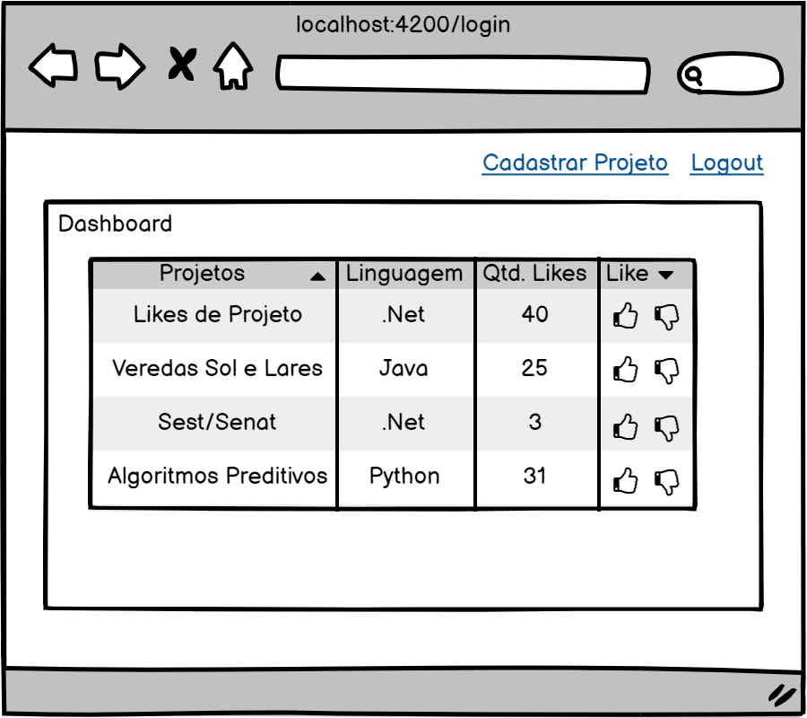

# Projeto Final - Angular Let's Like Project

O propósito desse desafio é a criação de frontend em Angular para um cadastro de projetos e Likes. Esse projeto contém login, listas, rotas, acesso ao back-end em .net core. As imagens abaixo são apenas uma ilustração da funcionalidade desejada:

## Tela de Login

### Funcionalidades

1. Usuário cadastrado, realiza o login na aplicação Let's Like Project ao clicar no botão Entrar;
2. Caso o usuário não tenha acesso, deverá realizar o cadastro ao clicar no item "Cadastrar Usuário";
3. Caso Usuário esqueceu a senha, deverá realizar a recuperação de senha no item "Recuperar Senha";

## Tela de Cadastrar Usuário

### Funcionalidades

1. Ao acessar o usuário terá como funcionalidade o Cadastro de usuário, preenche os dados de nome, cpf, username, e-mail, senha e confimação de senha;
2. Todos os campos são de preenchimento obrigatório, caso o usuário não peencha é apresentado uma mensagem de campo obrigatório.;
3. Caso todos os dados estejam preenchidos é enviado as infomações e o usuário é salvo com sucesso;

## Tela de Recuperar Senha

### Funcionalidades

1. Ao acessar o usuário terá como funcionalidade o recuperar senha, preenche os dados do e-mail;
2. O campo e-mail é de preenchimento obrigatório, caso o usuário não peencha é apresentado uma mensagem de campo obrigatório;
3. Caso todos os dados estejam preenchidos é enviado as infomações e a nova senha é enviada para o usuário que solicitou;

## Tela de Dashboard

### Funcionalidades

1. Ao acessar o usuário terá como funcionalidade a listagem de todos os projetos;

## Tela de Cadastrar Projetos

### Funcionalidades

1. Ao acessar o usuário terá como funcionalidade o Cadastro de Projeto, preenche os dados de nome, url, imagem e linguagem;
2. Todos os campos são de preenchimento obrigatório, caso o usuário não peencha é apresentado uma mensagem de campo obrigatório;
3. Caso todos os dados estejam preenchidos é enviado as infomações e o projeto é salvo com sucesso;

## Development server

Run `ng serve` for a dev server. Navigate to `http://localhost:4200/`. The app will automatically reload if you change any of the source files.

## Further help

To get more help on the Angular CLI use `ng help` or go check out the [Angular CLI Overview and Command Reference](https://angular.io/cli) page.